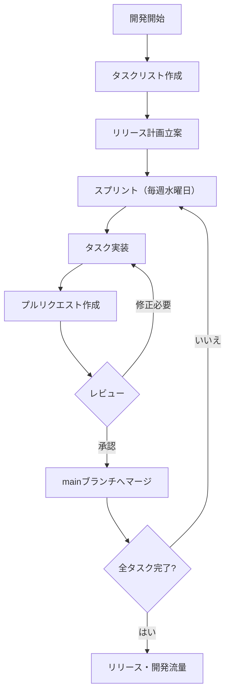
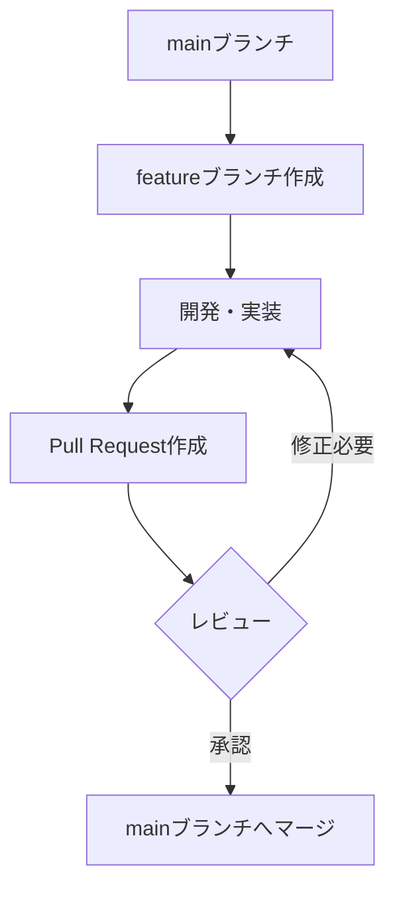

# チームっぽい開発の進め方について

## 概要
今まで、個人開発みたいな感じで、雑に開発していたので、チーム開発っぽい体制を作っていきたいです。
そのためのルールをまとめます。

## 目的
- チーム全体が、同じ方向を向いて、認識ずれがない状態で、良いプロダクトを開発したい。
- 安定した進捗管理と品質管理のため
  - プロダクト全体の進捗の見える化
  - 各人のタスク・進捗の見える化
- メンバーが増えた時に入りやすいように（サポートしやすいように）
- 振り返り・反省会をしていきたい

## 目次
- アジャイルっぽい開発の進め方
- Githubのプルリクエストについて
- ドキュメントについて

## アジャイルっぽい開発の進め方
githubのProjects機能を使って、タスクと進捗を管理します。

### 開発準備
#### やるべきこと（タスク）リストを作成
カンバンにタスクを洗い出します。
タスクの粒度は曖昧ですが、成果が見えるレベル を１タスクとします。
例）「○○ページのUI実装」「○○ツールの作成」といった具合です。

タスクはissueで管理します。以下のルールで新規追加してください。
- レポジトリに紐づけられるものは、必ず紐付ける。
- Statusは、デフォルトでNew とする。
- Sizeは、必ず選択する。（3day以上かかるものは、可能であれば分割する。無理にとは言わない。）

※追加タスクが発生した場合はどうするか？（例えば、フロント実装中に、APIに不具合があったりした時について）
原則は、やるべきことリストに追加して、次回のスプリントで話し合うする。緊急を伴う場合は、要相談。

#### リリース計画を立てる
チーム全員で、イテレーション計画を組む。
GithubのProjects機能を使います。

### 開発中
#### スプリント（イテレーション）
毎週水曜日にプロダクトに参加しているエンジニア全員で、１時間のMTGを実施します。
下記を実施します。
- 1週間の振り返り・進捗確認
- 1週間を振り返った時の疑問点/問題点/困っていること/悩み/やりづらさの共有
- やるべきことリストより次の1週間分のタスクを確認・決定
- やるべきことリストの見直し

#### 日々の進め方
- スプリントで決めたタスクを実装する。タスクが終わったらプルリクエストに出す。
- レビュワーは2名以上を選択する。1名がガチレビューをする。もう1名は気になれば&進捗把握のためです。

### 参照
- [アジャイル開発実践ガイドブック](https://cio.go.jp/sites/default/files/uploads/documents/Agile-kaihatsu-jissen-guide_20210330.pdf)
- [少人数チームでの機能開発とその体験談](https://support.genbasupport.com/techblog/topics-65626/)

## Githubのプルリクエストについて
### ブランチ戦略について
基本的にGithub Flowを則るスタイルにします。シンプルで小規模なissue開発を運用しやすいので。

#### ブランチ
- mainブランチ:
安定ブランチです。常にリリース可能なソースコードを管理します。
- feature/xxxxブランチ:
mainブランチから切ります。開発する機能に応じて作成します。xxxxには開発する機能の内容が書かれます。

#### コミットについて
意味のある単位を１コミットとします。
「意味のある単位」が分かりにくければ、[しまぶーさんの動画](https://www.youtube.com/watch?v=l9BY-uyZpGM&list=PLwM1-TnN_NN6fUhOoZyU4iZiwhLyISopO&index=2)を22:30~５分くらい見ると、イメージが深まります。

#### プルリクエスト
- featureブランチで開発が完了するとmainブランチにマージするためPull Requestを開発者が発行します。レビューは2名以上で実施します。
- プルリクエストのサイズは、１時間以内にレビューできる内容がベストです。
- 原則、実装者はマージしてはいけません。
- /./githubに、プルリクエストのテンプレファイルを実装してください。
- （可能であれば）/./github/workflows/ci.ymlに、lint等の静的解析を実装してください。

### 参照
- [小規模開発チームのブランチ戦略。GitHub Flowの導入](https://techblog.insightedge.jp/entry/branch-strategy-github-flow)

## ドキュメントについて
- レポジトリのルートにREADME.mdを用意する。第三者が開発に参加する時にスムーズに行くように記述しておく。
- その他、仕様がややこしい部分は、ドキュメントを作成する。
- 上記で、図解が必要な場合は、mermaid.js（githubで閲覧できる&Gitで管理しやすい）を利用する。

### 参照
- [GitHubのMarkdownファイルでMermaid記法](https://qiita.com/narita1980/items/2cc69fc1d481e4ee6b08)